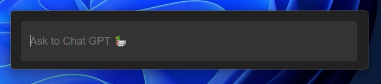
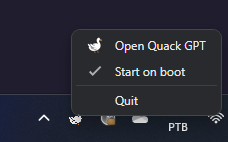

## Installation

Just to go [the latest release Github page](https://github.com/maiconfriedel/quack-gpt/releases/tag/1.0.0), download the .exe file, install it, and you're ready to go!

## Usage

There will be a 🦆 icon in the tray indicating the app is running.

Just click on it, or press `CTRL + ALT + I`, and it will open. Type the text you wanna ask to Chat GPT, press `ENTER`, and it will open in your default browser with that prompt.

You can press `ESC` to close the app back to tray, if you changed you mind.

## Start on boot

Left clicking on the tray icon, you can setup the app to start on boot.

